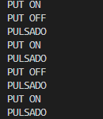

# PRACTICA 2 : INTERRUPCIONES
## Practica A interrupción por GPIO

### Codigo utilizado:
```cpp
#include <Arduino.h>

#define LED 16
unsigned long Mytime;
#define interruptpin 0
void  pin_interrupt();
void setup() {
  // put your setup code here, to run once:
Serial.begin(9600);
pinMode(LED,OUTPUT);
 attachInterrupt(digitalPinToInterrupt(interruptpin), pin_interrupt, FALLING);
}


void loop() {
  // put your main code here, to run repeatedly:
  Mytime=millis();
  while(millis()<Mytime+1000){}
  digitalWrite(LED,HIGH);
  Serial.println("PUT ON"); 
  Mytime=millis();
  while(millis()<Mytime+1000){}
  Serial.println("PUT OFF");
  digitalWrite(LED,LOW);
  
  
}

void pin_interrupt (){

Serial.println("PULSADO");

}
```

### Explicación del codigo:
Al principo de todo declaramos el pin 0 (boton boot de la placa) al pin de interrupcion que usaremos despues creamos un programa que vaya escribiendo por pantalla PUT ON i PUT OFF intermitentemente hasta que pulses el boton lo qual hace que aparcezca otra linia en elpuerto serie que dice PULSADO


### Salidas por el puerto serie:
Por pantalla se muestra lo siguiente:

